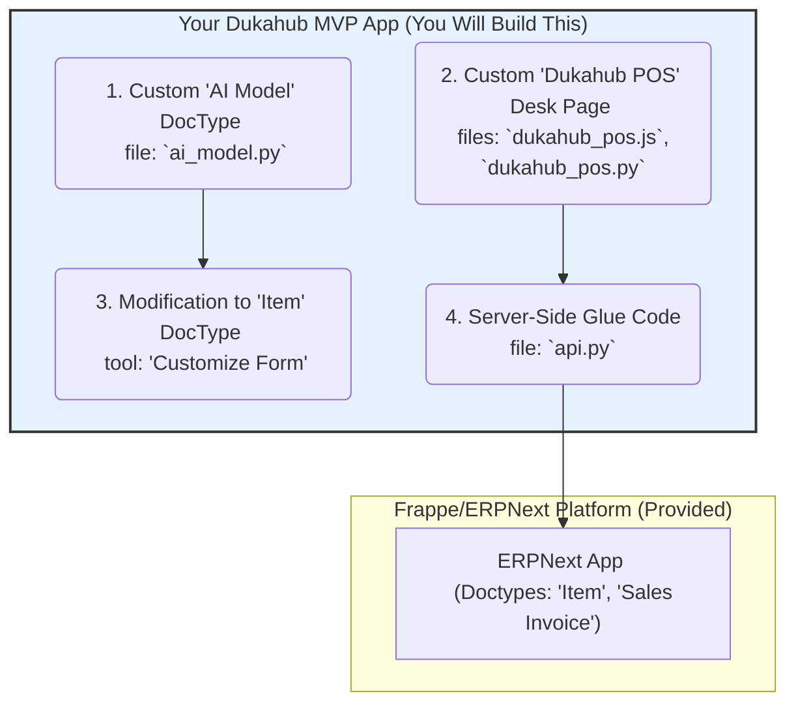

# Dukahub on Frappe: The MVP Plan

This document provides a concrete, step-by-step plan to build a functional Minimum Viable Product (MVP) of Dukahub on the Frappe platform. The goal is to prove the core "magic" (AI-powered POS) as quickly as possible by ruthlessly prioritizing features.

## The 80/20 Rule: MVP Scope

**MVP Goal:** A user can open a custom POS page on their phone, use the camera to recognize a product from a pre-trained AI model, see it added to a cart, and submit the sale. The sale must create a real `Sales Invoice` and deduct stock in the backend.

The following diagram shows the only parts of the system we will build or touch for the MVP.



**What We Will IGNORE for the MVP:**

- On-device AI model training. We will use one centrally-trained model.
- Payment gateway integration. All sales are "Cash".
- Advanced user permissions. We will use the Administrator account for everything.
- PWA / Offline Mode. The MVP requires an internet connection to function.

---

## Phase 0: Environment Setup (1 Day)

**Goal:** Get a Frappe development environment running inside Docker, with your local custom app code mounted into the container for live editing. This approach is faster, cleaner, and more consistent than a manual installation.

1.  **Prerequisites:**
    - Install [Docker Desktop](https://www.docker.com/products/docker-desktop/).
    - Install [Visual Studio Code](https://code.visualstudio.com/) with the [Dev Containers extension](https://marketplace.visualstudio.com/items?itemName=ms-vscode-remote.remote-containers).

2.  **Clone `frappe_docker`:**
    - This is the official repository for running Frappe and ERPNext on Docker.
    - `git clone https://github.com/frappe/frappe_docker.git`
    - `cd frappe_docker`

3.  **Create Your Custom App:**
    - Create a directory for your app(s) outside the `frappe_docker` folder. We will mount this into the container.
    - `mkdir ../apps && cd ../apps`
    - `git clone <your-dukahub-app-repo-url> dukahub_mvp` (Or `bench new-app dukahub_mvp` later)

4.  **Configure the Docker Environment:**
    - Copy the example development compose file: `cp devcontainer.example.yml docker-compose.yml`
    - **Crucially, edit `docker-compose.yml`:** Under the `workspace` service, find the `volumes` section. Add a new line to mount your custom app folder:
      ```yaml
      volumes:
        - ../apps:/workspace/apps
      ```

5.  **Launch the Dev Container:**
    - **Action:** Open the `frappe_docker` folder in VS Code. The "Dev Containers" extension will prompt you to "Reopen in Container". Click it.
    - **What Happens:** VS Code will automatically build the Docker images using the `docker-compose.yml` file, start all the required services (database, Redis, Frappe), and connect your VS Code editor directly into the running `workspace` container. You get a terminal and full file access _inside_ the container, but you are editing files that live on your local machine.

6.  **Setup Site and Install Apps (Inside the VS Code Terminal):**
    - Once the container is running, you'll have a terminal. All `bench` commands are run here.
    - Create a new bench workspace (this is inside the container):
      ```bash
      bench init --skip-redis-config-generation --frappe-branch version-15 frappe-bench
      ```
    - Move into the bench directory: `cd frappe-bench`
    - Set the bench to use the container's database and redis hosts:
      ```bash
      bench set-mariadb-host mariadb
      bench set-redis-cache-host redis-cache:6379
      bench set-redis-queue-host redis-queue:6379
      ```
    - Create your site: `bench new-site dukahub.local --no-mariadb-socket`
    - Install ERPNext and your custom app:
      ```bash
      bench get-app erpnext --branch version-15
      bench --site dukahub.local install-app erpnext
      bench get-app dukahub_mvp --resolve-deps ../apps/dukahub_mvp # The path to your mounted app
      bench --site dukahub.local install-app dukahub_mvp
      ```

7.  **Start the Server:**
    - `bench start`
    - VS Code will automatically forward port 8000. You can now open `http://localhost:8000` in your browser and log in as "Administrator". Any changes you make to your `dukahub_mvp` code on your local machine will be reflected instantly.

## Phase 1: Backend Foundation (1 Day)

Goal: Create the database structure to hold our AI model files.

1.  **Create `AI Model` DocType:**
    - **Action:** Create a new DocType in your `dukahub_mvp` app.
    - **AI Prompt:** _"Generate the Python code and JSON for a new Frappe DocType named `AI Model`. It should have one Data field named `model_name`. It needs to be a submittable document and allow attachments."_
2.  **Customize `Item` DocType:**
    - **Action:** In the ERPNext search bar, type `Customize Form` and select `Item`. Add a new field linking to your `AI Model` DocType. This requires no code.
    - **Details:**
      - **Label:** `AI Model`
      - **Type:** `Link`
      - **Options:** `AI Model`
3.  **Create First `AI Model` Record & Upload Files:**
    - **Action:** In the UI, go to the "AI Model List". Create a new record named "General Store Model". In the sidebar, upload your pre-trained `model.json` and `weights.bin` files as attachments.

## Phase 2: The Frontend "Magic" (2-3 Days)

Goal: Build the camera UI that recognizes products.

1.  **Create the `Dukahub POS` Page:**
    - **Action:** In your `dukahub_mvp` app, create a new `Desk Page` named "Dukahub POS". This will create the necessary `dukahub_pos.js`, `.py`, and `.html` files.
2.  **Build the Basic Camera UI:**
    - **Action:** In the `.html` file, add a `<video>` element for the camera feed and a `<div>` to act as the cart display.
    - **AI Prompt:** _"Give me the JavaScript for a Frappe Desk Page that uses `navigator.mediaDevices.getUserMedia` to display a camera feed in a `<video>` element."_
3.  **Load TFLite Model & Run Inference:**
    - **Action:** In the `.js` file, fetch the attachment URLs for your "General Store Model" record. Load the model using TensorFlow.js and run `predict()` in a loop on the video feed.
    - **AI Prompt:** _"In my Frappe JS, show me how to use `frappe.db.get_value` to get the file URL of an attachment from an 'AI Model' document named 'General Store Model'. Then show me how to load this model with TensorFlow.js Lite."_
4.  **Populate the Cart:**
    - **Action:** When the model recognizes an item, call a backend function to get its price. Add the item to a simple JavaScript array (the cart) and update the cart `<div>` on the page.

## Phase 3: The Final Glue (1 Day)

Goal: Connect the frontend to the backend to complete a sale.

1.  **Create the Backend API:**
    - **Action:** Create a file `dukahub_mvp/api.py`. In this file, you will write the whitelisted Python functions that your JavaScript POS calls.
2.  **Write `get_item_details` function:**
    - **Action:** Create a whitelisted function that takes an `item_code` and returns a dictionary with the item's price and name from the `Item` DocType.
    - **AI Prompt:** _"Write a whitelisted Frappe Python function `get_item_details(item_code)`. It should look up the `Item` with the given `item_code` and return its `item_name` and `standard_selling_rate`."_
3.  **Write `submit_pos_sale` function:**
    - **Action:** This is the most critical function. It takes a list of item codes (the cart), creates a new `Sales Invoice` document, populates its `items` table, and submits it. This single action will automatically update inventory and accounting ledgers.
    - **AI Prompt:** _"Write a whitelisted Frappe Python function `submit_pos_sale`. It should accept a list of item codes. It needs to create a new 'Sales Invoice' for the customer 'Walk-in', set the `items` in its child table based on the input list (fetching the price for each), and then call `doc.submit()`."_

By the end of this plan, you will have a working, demonstrable prototype that validates the core premise of Dukahub, built on a scalable and maintainable foundation.
