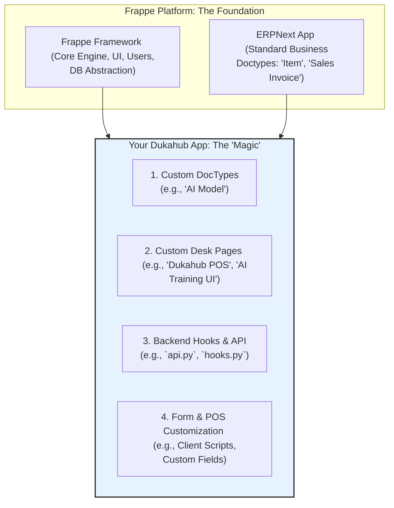

# Dukahub on Frappe: Architecture Guide

This document defines the technical architecture for the Dukahub application built on the Frappe platform. It serves as a map for all development, ensuring consistency, maintainability, and alignment with our vision.

## Vision & Ethos

*   **Vision:** To eliminate manual transaction logging for SMEs by leveraging the hardware they already own (smartphones) combined with the power of AI.
*   **Ethos:** Our engineering principle is **system-level optimization**. We prioritize developer velocity and speed-to-value by building on a robust platform, allowing us to focus our energy on our unique value proposition: the AI-powered POS experience.

## The Layered Architecture

We embrace a layered architecture that clearly separates the platform from our custom application. This is key to our strategy of leveraging community updates while developing our IP independently.

## Understanding the Customization Layers: Frappe vs. ERPNext

It is critical to understand that we are extending **both** the Frappe platform and the ERPNext application, but at different levels.

*   **Frappe** is the low-level **Platform/Framework**. It gives us the raw tools: the ability to create models (DocTypes), pages (Desk Pages), and APIs. It knows nothing about "sales" or "inventory."
*   **ERPNext** is a large **Application** built using Frappe's tools. It provides specific business documents like `Item`, `Customer`, and `Sales Invoice`.

Our Dukahub App is another application that sits alongside ERPNext. We will use Frappe's tools to create our own new features, and we will also use Frappe's tools to interact with ERPNext's features. The following table breaks down each MVP task to make this distinction clear.

| MVP Task | Customization Level | Why? | Where It Lives |
| :--- | :--- | :--- | :--- |
| Create `AI Model` DocType | **Frappe** (Platform) | We are creating a brand new object type from scratch. | `dukahub_mvp/doctype/ai_model/` |
| Create `Dukahub POS` Page | **Frappe** (Platform) | We are creating a brand new, custom UI screen. | `dukahub_mvp/page/dukahub_pos/` |
| Create `api.py` file | **Frappe** (Platform) | We are creating new, secure API endpoints for our app. | `dukahub_mvp/api.py` |
| Add link field to `Item` | **ERPNext** (Application) | We are **modifying** an existing ERPNext document. | **In the database** (via Customize Form) |
| `get_item_details()` | **ERPNext** (Application) | Our code **reads data from** an ERPNext document. | `dukahub_mvp/api.py` |
| `submit_pos_sale()` | **ERPNext** (Application) | Our code **creates and saves** an ERPNext document. | `dukahub_mvp/api.py` |

## Core Frappe Concepts We Will Use

*   **DocType:** The fundamental building block. A DocType is a model, controller, and view definition in one. It automatically generates database tables, API endpoints, and web views.
    *   *Our Use:* We will create a custom `AI Model` DocType and add custom fields to the standard `Item` DocType.
*   **Desk Page:** A blank canvas for building custom user interfaces with HTML, JavaScript, and CSS. This is where single-page applications are built.
    *   *Our Use:* The entire `Dukahub POS` experience and the `AI Training` interface will be built as Desk Pages.
*   **Whitelisted Python Functions:** Functions in our app's Python files decorated with `@frappe.whitelist()`. These are securely exposed as private API endpoints that our Desk Pages can call.
    *   *Our Use:* This is the "glue" layer. Our `api.py` will contain functions like `submit_pos_sale`.
*   **Hooks:** A file (`hooks.py`) in our app that allows us to inject our custom logic into standard ERPNext events (e.g., when a `Sales Invoice` is submitted).
*   **Client Script:** Custom JavaScript that runs on a specific DocType form, allowing for dynamic UI behavior and validation.

## Feature Implementation Map

This map outlines where current and future Dukahub features will live within the architecture.

| Feature | Architectural Component | Files to Touch | Status |
| :--- | :--- | :--- | :--- |
| **AI/Barcode POS** | Desk Page + Backend API | `dukahub_pos.js`, `api.py` | **MVP** |
| **AI Model Storage** | Custom DocType | `ai_model.py`, `ai_model.json` | **MVP** |
| **Basic Inventory**| Standard ERPNext DocType | `Item` (via no-code customization)| **MVP** |
| **Basic Sales Log**| Standard ERPNext DocType | `Sales Invoice` (created via `api.py`) | **MVP** |
| **AI Model Training UI**| Desk Page | `ai_training_ui.js` | Future |
| **PWA / Offline Mode**| Service Worker + JS | `dukahub_pos.js` (add IndexedDB logic) | Future |
| **Credit Sales / M-Pesa**| Standard ERPNext + API | `Sales Invoice` DocType, Payment Gateway API | Future |
| **Advanced Reporting**| Script Report | `reports/` folder | Future |
| **Multi-User/Permissions**| Standard Frappe Feature | No code, configure from Admin UI | Future |

This architecture provides a clear and scalable path forward, allowing us to build a powerful, maintainable, and extensible application. 